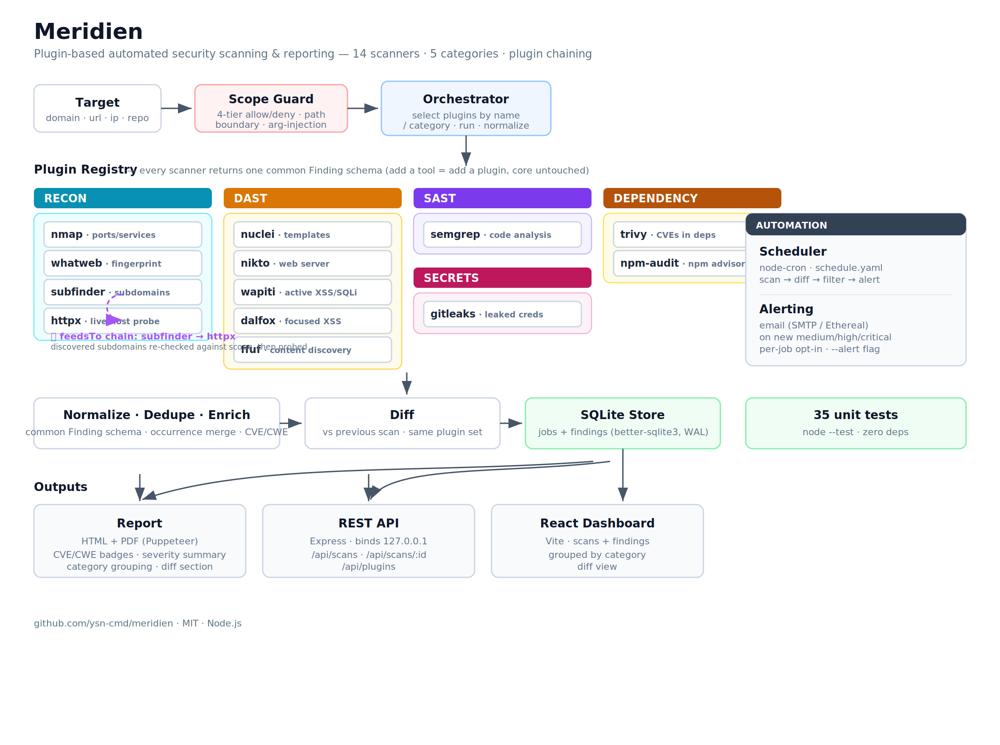

# Meridien

A plugin-based automated security scanning and reporting platform. Meridien runs
reconnaissance, dynamic (DAST), static (SAST) and secrets scans through a single
orchestration core, normalizes every tool's output into one common schema, and
turns the results into deduplicated, diff-aware reports — available on the CLI, as
PDF/HTML, through a REST API, and in a React dashboard. It can also run on a
schedule and email you when new findings appear.


## Architecture



Every scanner is a **plugin** that returns the same `Finding` schema, so the core,
processing, storage and reporting layers never need to know which tool produced a
result. Plugins declare a **category** (recon, dast, sast, secrets), which the
whole pipeline uses for selection, grouping and reporting. Adding a new tool means
adding a plugin — the rest of the pipeline is untouched.

## Features

- **Fifteen scanners across five categories, one contract:**
  - **recon** — `nmap` (ports/services), `whatweb` (tech fingerprint), `subfinder` (subdomain discovery), `httpx` (live-host probe), `naabu` (fast port scan)
  - **dast** — `nuclei` (templates), `nikto` (web server), `wapiti` (active XSS/SQLi), `dalfox` (focused XSS), `ffuf` (content discovery)
  - **sast** — `semgrep` (code analysis)
  - **secrets** — `gitleaks` (leaked credentials)
  - **dependency** — `trivy` (known CVEs in dependencies), `npm-audit` (npm advisory DB)

  Every scanner is normalized into a common `Finding` schema.
- **Category selection** — run every plugin in a category with one flag
  (`--category dast`), instead of naming each tool.
- **Plugin chaining** — discovery plugins can feed their results into another
  plugin automatically. `subfinder,httpx` together: subfinder's discovered
  subdomains are scope-checked, then probed by httpx in one pass — a real
  recon chain, not two separate scans.
- **Deduplication** — identical findings are collapsed with an occurrence count.
- **Diff** — each scan is compared against the previous scan of the same target
  *with the same plugin set*, surfacing newly introduced and resolved findings.
- **CVE & CWE enrichment** — findings are tagged with their CVE (specific
  vulnerability) or CWE (weakness class) where available.
- **Reporting** — self-contained HTML and PDF reports (via Puppeteer), with
  severity summaries, badges, category grouping and a "Changes" section.
- **REST API + React dashboard** — browse scans and findings interactively,
  grouped by category.
- **Scheduling & alerting** — periodic scans via `node-cron`; email alerts (SMTP)
  on new medium/high/critical findings, opt-in per job.
- **Scope enforcement** — a 4-tier allowlist/denylist gate with path-boundary and
  argument-injection protection, so only authorized targets are ever scanned.

## Requirements

- **Node.js >= 18**
- **System Chromium** for PDF reports (`CHROME_PATH` override supported)
- External scanners on `PATH` (each supports a `*_PATH` env override):

  | Category | Tool | Install | Env override |
  |----------|------|---------|--------------|
  | recon | [`nmap`](https://nmap.org) | `apt install nmap` | — |
  | recon | [`whatweb`](https://github.com/urbanadventurer/WhatWeb) | `apt install whatweb` | `WHATWEB_PATH` |
  | recon | [`subfinder`](https://github.com/projectdiscovery/subfinder) | `go install` | `SUBFINDER_PATH` |
  | recon | [`httpx`](https://github.com/projectdiscovery/httpx) | `apt install httpx-toolkit` | `HTTPX_PATH` |
  | recon | [`naabu`](https://github.com/projectdiscovery/naabu) | `apt install naabu` | `NAABU_PATH` |
  | dast | [`nuclei`](https://github.com/projectdiscovery/nuclei) | see project | — |
  | dast | [`nikto`](https://github.com/sullo/nikto) | `apt install nikto` | `NIKTO_PATH` |
  | dast | [`wapiti`](https://wapiti-scanner.github.io) | `apt install wapiti` | `WAPITI_PATH` |
  | dast | [`dalfox`](https://github.com/hahwul/dalfox) | `go install` | `DALFOX_PATH` |
  | dast | [`ffuf`](https://github.com/ffuf/ffuf) | `apt install ffuf` | `FFUF_PATH` |
  | sast | [`semgrep`](https://semgrep.dev) | `pip install semgrep` | `SEMGREP_PATH` |
  | secrets | [`gitleaks`](https://github.com/gitleaks/gitleaks) | `apt install gitleaks` | `GITLEAKS_PATH` |
  | dependency | [`trivy`](https://github.com/aquasecurity/trivy) | `apt install trivy` | `TRIVY_PATH` |
  | dependency | [`npm-audit`](https://docs.npmjs.com/cli/commands/npm-audit) | bundled with `npm` | `NPM_PATH` |

  Only the tools you actually run need to be installed; a plugin whose binary is
  missing fails gracefully without stopping the scan.

## Installation

```bash
git clone https://github.com/ysn-cmd/meridien.git
cd meridien
npm install
npm --prefix frontend install     # dashboard dependencies

cp scope.example.yaml scope.yaml           # define your authorized targets
cp schedule.example.yaml schedule.yaml     # (optional) scheduled scans
cp .env.example .env                        # (optional) SMTP for alerts
```

## Usage

### Scan (CLI)

```bash
# name plugins explicitly
npm run scan -- --target scanme.nmap.org --plugins nmap,nuclei --report

# or run a whole category
npm run scan -- --target http://localhost:8080 --category dast --report
```

Common flags:

| Flag | Description |
|------|-------------|
| `--target, -t` | Target to scan (must be allowed by `scope.yaml`) |
| `--plugins, -p` | Comma-separated plugins: `nmap,nuclei,whatweb,...` |
| `--category, -c` | Run all plugins in a category: `recon,dast,sast,secrets` |
| `--report, -r` | Generate HTML + PDF report |
| `--alert` | Email on new findings above the severity threshold |
| `--min-severity` | Alert threshold: `medium` (default), `high`, `critical` |

`--plugins` and `--category` can be combined; the two sets are merged. A plugin
that does not support the target type is skipped automatically.

### API + dashboard

```bash
npm run serve        # REST API + built dashboard on http://127.0.0.1:3000
npm run dashboard    # frontend dev server (http://localhost:5173, proxies /api)
```

Endpoints:

| Endpoint | Description |
|----------|-------------|
| `GET /api/scans` | All scans, newest first |
| `GET /api/scans/:id` | One scan: job, findings and diff |
| `GET /api/plugins` | Registered plugins and their categories |

### Scheduled scans & alerts

```bash
npm run schedule                       # run on the cron schedule in schedule.yaml
node src/scheduler/index.js --once     # run every job once (for testing)
```

## Configuration

- **`scope.yaml`** — allowlist/denylist of authorized targets (required).
- **`schedule.yaml`** — scheduled jobs (`target`, `plugins`, `cron`, `alert`) and
  the global alert threshold.
- **`.env`** — SMTP settings for email alerts. If left empty, an
  [Ethereal](https://ethereal.email) test account is used and a preview URL is
  printed (no real email is sent).

Real config files are gitignored; the committed `*.example` files show the format.

## Project structure

```
meridien/
├── bin/            CLI entry point
├── src/
│   ├── core/       orchestration, Finding schema, scope, diff, cve/cwe
│   ├── plugins/    base factory + registry + one folder per scanner
│   │               (recon/dast/sast/secrets)
│   ├── reporting/  HTML/PDF report generation
│   ├── store/      SQLite persistence
│   ├── api/        Express API + static dashboard
│   ├── alerting/   email notifier + alert check
│   └── scheduler/  node-cron scheduler
├── frontend/       React + Vite dashboard
├── docs/           architecture diagram
└── test/           unit tests
```

Each scanner lives in `src/plugins/<name>/index.js` and is built on the shared
`src/plugins/base.js` factory, which handles process spawning, timeouts,
process-group termination, temp files and empty-output handling — a new plugin
only declares its command, arguments and output parser.

## Testing

```bash
npm test
```

36 unit tests (Node's built-in runner, zero dependencies) cover the schema,
deduplication, diff, CVE/CWE extraction, scope enforcement (including the
path-boundary and argument-injection protections), and the category system
(registry lookups, finding tagging, report grouping).

## Responsible use

Meridien is intended for authorized security testing only. Scan targets you own
or have explicit written permission to test. The scope allowlist is a safeguard,
not a substitute for authorization. Active scanners (`nikto`, `wapiti`) send real
attack traffic — run heavy or active scans against staging environments, not live
production. The authors accept no liability for misuse.

## License

[MIT](LICENSE) (c) ysn-cmd
